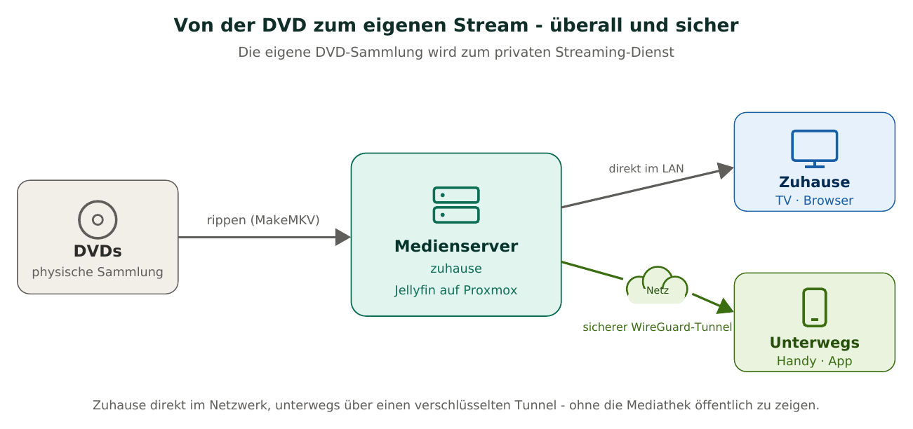
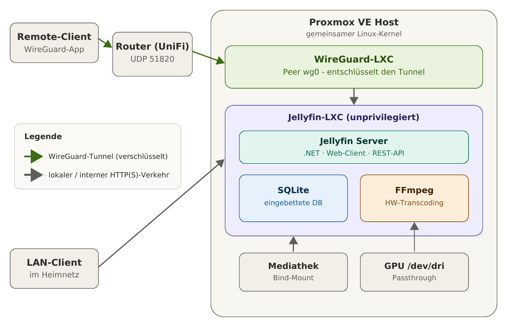
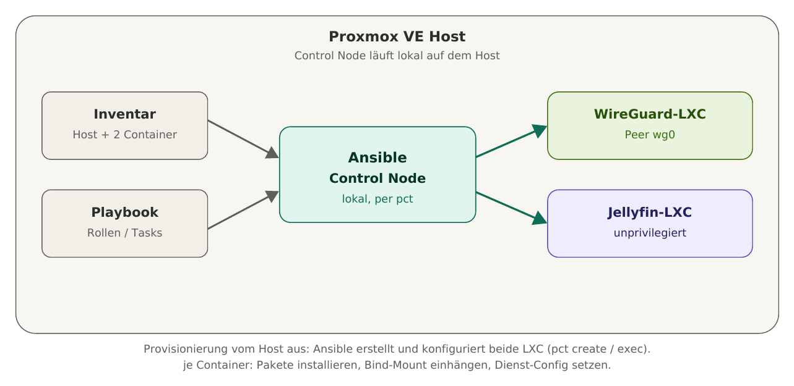

# Projektspezifikation

> Selbst gehosteter Medienserver im eigenen Homelab auf Proxmox VE
> Autor: Manuel Sager - Schule: Teko Bern - Modul: Netzwerktechnologien

## 1. Einleitung

Dieses Projekt verwandelt eine physische DVD-Sammlung in einen privaten,
selbst gehosteten Streaming-Dienst: Zuhause direkt im Netzwerk erreichbar,
unterwegs über einen verschlüsselten Tunnel, ohne die Mediathek öffentlich zugänglich zu machen.

## 2. Ausgangslage und Zielsetzung
### 2.1 Ausgangslage 
Physische Medien (DVDs) sollen digitalisiert und über das eigene Netzwerk sowie unterwegs gestreamt werden können,
ohne Abhängigkeit von kommerziellen Streaming-Diensten und ohne die eigene Mediathek dem öffentlichen Internet
auszusetzen. Als Plattform dient ein bestehender Proxmox-VE-Host; als Medienserver kommt die quelloffene Software
Jellyfin zum Einsatz.

### 2.2 Projektziel 
Ziel ist die reproduzierbare, automatisierte Bereitstellung eines Medienserver-Systems. Fachlicher Schwerpunkt sind die Provisionierung der Container per Ansible (vom Inventar aus), die VPN-Schlüsselverwaltung (Keypair-Erzeugung und -Austausch) sowie das API-gestützte Benutzer-Onboarding. Jellyfin dient dabei als konkreter Anwendungsfall.

### 2.3 Nutzen
- Volle Datenhoheit über die eigene Mediathek, kein laufendes Abo und immer dabei
- Sicherer Zugriff von unterwegs, ohne Jellyfin öffentlich zu zeigen
- Wiederholbare, dokumentierte Einrichtung
- Neue Nutzer in einem Arbeitsschritt onboard bar

## 3. Umfang und Abgrenzung
### 3.1 Im Umfang enthalten
- Rippen der DVDs zu verlustfreien Dateien mit MakeMKV.
- Einbindung des Medienspeichers auf dem Host (Festplatte 4T) und durchreichen in den Container.
- Erstellung eines LXC-Containers per Ansible-Playbook (Provisionierung vom Inventar aus.
- Installation, Grundkonfiguration und Bibliotheks-Einrichtung von Jellyfin.
- iGPU-Passthrough Hardware -Transcoding über die integrierte GPU
- Lokaler Zugriff über den Browser sowie native Apps
- Fernzugriff über WG (sep. LXC, da schon existiert im Homelab), Portfreigabe und Anpassung im Router und Netzwerk.
- Benutzerverwaltungen in Jellyfin mit Bibliotheks-Berechtigungen.
- Automatisierungs- / Welcome-Skript: WG-Peer + Jellyfin Nutzer v+ PDF Ausgabe von QR und Zugangsdaten

### 3.2 Nicht im Umfang enthalten
- Hochverfügbarkeit / Cluster-Betrieb mehrerer Nodes
- Live-TV, Musik, File-, Foto-Bibliotheken
- Öffentliche Erreichbarkeit ohne VPN - Reverse Proxy Betrieb ist bewusst nicht teil des Projekts

## 4. Systemarchitektur
Der Proxmox-Server (Host) bildet die Virtualisierungsebene. WireGuard und Jellyfin laufen in getrennten LXC-Containern um eine klare Trennung von Netzwerk-Funktion und Anwendung zu gewährleisten. Ausserdem besteht bereits das Setup eines LXC mit WireGuard auf dem Proxmox-Server.
Remote-Clients werden sich über einen VPN-Tunnel auf die Umgebung verbinden, darin wird Jellyfin dann direkt angesprochen. Die Festplatte sowie die iGPU liegen auf dem Host und werden direkt in den LXC mit Jellyfin durchgereicht. 

  

### 4.1 Komponentenübersicht
| Komponente | Rolle | Technologie                                     |
|------------|-------|-------------------------------------------------|
| Proxmox VE Host | Virtualisierungsebene, stellt LXC bereit | HP Elite Desk G5 - Proxmox VE `Version: 9.1`    |
| WireGuard-LXC | Terminiert VPN-Tunnel, Netzwerkübergang | Debian LXC + WireGuard                          |
| Jellyfin-LXC | Medienserver-Anwendung | Debian LXC + Jellyfin `Version: 10.11.0`        |
| Datenbank | Bibliotheks-/Nutzerdaten | SQLite (in Jellyfin eingebettet)                |
| Transcoder | Echtzeit-Umwandlung inkompatibler Formate | FFmpeg + iGPU (QuickSync)                       |
| Storage | Ablage der gerippten Medien | WD 4TB Festplatte - Host-Verzeichnis, Bind-Mount |
| Automatisierung | Nutzer-Onboarding + PDF | `Bash / Python Welcomesript`                    |

### 4.2 Automatisierungskonzept (Welcome-Skript)
1. Aufruf mit einem Argument (Benutzername).
2. WireGuard: Keypair via `wg genkey`/`pubkey`, freie Tunnel-IP aus dem
   Peer-Subnetz ermitteln, Peer-Block in die Server-Config eintragen,
   ohne Neustart aktivieren (`wg set`).
3. Jellyfin: über die REST-API (Admin-Token) Konto anlegen (`POST /Users/New`),
   Passwort setzen, Bibliotheks-Berechtigungen zuweisen.
4. Client-Config erzeugen, daraus QR-Code (`qrencode`).
5. Welcome-PDF (QR + Zugangsdaten) generieren.
6. Fehlerbehandlung: existiert der Nutzer bereits, sauberer Abbruch.

### 4.3 Provisionierung / Automatisierungsarchitektur
 

## 5. Datenfluss
- **Fernzugriff:** Remote-Client - WG-App baut Tunnel - Router leitet UDP 51820 an WG-LXC weiter WG-LXC entschlüsselt - Jellyfin wird intern per HTTP angesprochen
- **Lokaler Zugriff:** LAN-Client - direkt per HTTP auf den Jellyfin-Server ohne WG 
- **Wiedergabe:** Jellyfin prüft die Client-Fähigkeiten und liefert die gewünschte Wiedergabe
- **Speicher:** Medien liegen auf Festplatte am Host, werden als Bind-Mount schreib-/lesegerecht in den Jellyfin-LXC durchgereicht

## 6. Funktionale Anforderungen (messbar und testbar)

| ID | Anforderung                          | Messbares Ziel (Was)                                                                                      | Verifikation (Wie)                                                                                                                           |
|----|--------------------------------------|-----------------------------------------------------------------------------------------------------------|----------------------------------------------------------------------------------------------------------------------------------------------|
| F1 | Medien rippen                        | Mindestens 4 DVDs liegen als verlustfreie MKV-Dateien im Storage vor.                                     | Verzeichnis auflisten, Stichprobe von 2 Titeln wird korrekt abgespielt.                                                                      |
| F2 | Storage-Einbindung                   | Mediathek ist im Jellyfin-LXC unter `/media` sichtbar und für den Jellyfin-Benutzer lesbar.               | Im Container `ls /media/DVDs` zeigt dieselben Dateien wie auf dem Host, Testdatei ist durch den Dienst-User lesbar (Rechte/Mapping korrekt). |
| F3 | Provisionierung per Ansible | Jellyfin-LXC wird durch ein Ansible-Playbook vom Inventar aus reproduzierbar erstellt und grundkonfiguriert (Container, Pakete, Bind-Mount, Jellyfin). | Playbook gegen leeren Host ausführen; danach `pct status` = `running` und Jellyfin ohne manuelle Schritte per Browser erreichbar. |
| F4 | Jellyfin eingerichtet                | Mind. 1 Bibliothek konfiguriert, Metadaten für ≥ 80% der Titel geladen.                                   | Web-UI zeigt Poster/Beschreibung, Abgleich Titelanzahl vs. Titel mit Metadaten.                                                              |
| F5 | Lokaler Browser-Zugriff              | Web-Client erreichbar unter `http://JellyfinStream:8096`, Login und Wiedergabe möglich.                   | Vom LAN-Gerät einloggen und einen Titel abspielen.                                                                                           |
| F6 | Hardware-Transcoding                 | Mind. 2 parallele 1080p-Transcodes laufen ruckelfrei über die iGPU.                                       | 2 Clients erzwingen Transcode, `intel_gpu_top` zeigt GPU-Last, keine Aussetzer über 5 min Testphase.                                         |
| F7 | WireGuard-Fernzugriff                | Zugriff aus einem Fremdnetz nur über den Tunnel, Wiedergabe funktioniert.                                 | Über Mobilfunk auf dem Handy WG aktivieren → Login + Wiedergabe, ohne WG kein Zugriff.                                                       |
| F8 | Minimale Sicherheit (Angriffsfläche) | Von aussen ist ausschliesslich UDP 51820 erreichbar; Port 8096 ist geschlossen.                           | `nmap` gegen die öffentliche IP; nur 51820/udp offen, 8096 gefiltert/geschlossen.                                                            |
| F9 | Portfreigabe / Router                | Genau eine Portweiterleitung (UDP 51820 → WireGuard-LXC) im UniFi-Controller.                             | Konfigurations-Screenshot, externer Portscan bestätigt Weiterleitung.                                                                        |
| F10 | Multi-Client-Wiedergabe              | Wiedergabe auf mind. 3 verschiedenen Client-Typen (Browser, Mobile-App, TV-App).                          | Je Client-Typ: Login und erfolgreiche Wiedergabe eines Titels.                                                                               |
| F11 | Benutzerverwaltung                   | Getrennte Jellyfin-Konten mit unterschiedlichen Bibliotheks-Berechtigungen.                               | User A sieht Bibliothek X, aber nicht Y,  mit zweitem Konto gegenprüfen.                                                                     |
| F12 | Onboarding-Automatisierung | Ein Skriptaufruf führt den gesamten Prozess aus: WireGuard-Keypair erzeugen, Public Key + zugewiesene Tunnel-IP in die Server-Config eintragen (Schlüssel-Austausch), Jellyfin-Konto per REST-API anlegen und Bibliotheks-Rechte setzen, sowie ein Welcome-PDF mit QR-Code (WG-Config) und Zugangsdaten erzeugen. | Skript ausführen; QR scannen → Tunnel verbindet; PDF-Zugangsdaten → Jellyfin-Login gelingt; erneuter Aufruf mit gleichem Namen bricht sauber ab. |

## 7. Nicht funktionale Anforderungen (messbar und testbar)

| ID | Kategorie | Anforderung (messbar) | Verifikation (Wie) |
|----|-----------|------------------------|--------------------|
| N1 | Sicherheit | Jellyfin ist nie direkt aus dem Internet erreichbar, Fernzugriff ausschliesslich über WireGuard. Beide Container laufen unprivilegiert. | Externer Portscan zeigt 8096/TCP geschlossen; `pct config <id>` weist beide Container als `unprivileged: 1` aus. |
| N2 | Performance | Startzeit der Wiedergabe (Direct Play) im LAN < 3 s, Transcode-Start < 10 s. | Mit Stoppuhr/Client-Log an 3 Titeln messen: Zeit von „Play" bis Bildstart im LAN und beim erzwungenen Transcode. |
| N3 | Reproduzierbarkeit | Gesamter Aufbau ist über dokumentierte Befehle bzw. das Skript wiederholbar (Dokumentation wird fortlaufend geführt). | Container einmal nach Doku neu aufsetzen; Ergebnis entspricht dem Original ohne undokumentierte Handgriffe. |
| N4 | Wartbarkeit / Backup | Container inkl. Konfiguration und SQLite-DB per `vzdump` sicherbar; Wiederherstellung getestet. | Backup mit `vzdump` erstellen, in Test-Container zurückspielen (`pct restore`); Jellyfin startet mit gleichen Daten. |
| N5 | Usability | Neuer Nutzer ist mit dem Onboarding-PDF ohne weitere Anleitung einsatzfähig. | Unbeteiligte Testperson richtet sich allein mit dem PDF (QR + Zugangsdaten) ein und spielt einen Titel ab. |

## 8. Test- und Abnahmekonzept 
> Die Verifikation erfolgt anhand der Spalten `Verifikation` in Kap. 6 sowie Kap.7. Jede Anforderung gilt als abgenommen, wenn der jeweilige Test reproduzierbar besteht. 

### 8.1 Testumgebung 
- Interner Test: Client im Heim-Lan 
- Externer Test: Client im Mobilfunknetz, Zugriff via WG 
- Sicherheits-Test: Externer Portscan (nmap) gegen die öffentliche IP 
- Last und Transcoding-Test: Parallele Streams, beobachtung der GPU Last des Proxmox Host's

### 8.2 Abnahmekriterium 
Das Projekt gilt als erfolgreich, wenn alle Anforderungen F1-F12 und N1-N5 bestanden sind.

## 9. Vorgehen und Meilensteine

| M | Meilenstein | Ergebnis / Nachweis |
|----|-------------|---------------------|
| M1 | Medien digitalisiert | DVDs gerippt, Dateien im Storage (F1). |
| M2 | Host & Storage bereit | Bind-Mount und Rechte korrekt (F2). |
| M3 | Container per Ansible provisioniert | Jellyfin-LXC durch Playbook vom Inventar aus erstellt und grundkonfiguriert (F3). |
| M4 | Jellyfin lauffähig | Bibliothek + lokaler Zugriff + Transcoding (F4–F6). |
| M5 | Fernzugriff steht | WireGuard + Router + Portscan (F7–F9). |
| M6 | Clients & Nutzer | Multi-Client + Benutzerverwaltung (F10–F11). |
| M7 | Onboarding automatisiert | Welcome-Skript: WG-Schlüsselaustausch + Jellyfin-User via API + PDF (F12). |
| M8 | Abnahme | Alle Tests bestanden, Doku vollständig. |

## 10.l Voraussetzungen, Annahmen und Risiken 

| Thema              | Beschreibung                                                                                             | Massnahme                                                                                                                                                                                                |
|--------------------|----------------------------------------------------------------------------------------------------------|----------------------------------------------------------------------------------------------------------------------------------------------------------------------------------------------------------|
| Dynamische IP      | Die Heim-IP wechselt normalerweise unregelmässig, Remote-Clients müssen den Endpunkt zuverlässig finden. | Dynamic-DNS-Dienst (DDNS) einrichten. (existiert bereits)                                                                                                                                                |
| Hardware | Transcoding benötigt eine iGPU mit QuickSync sowie ausreichend RAM/Disk. | Vorhanden: HP EliteDesk 800 G5 mit Intel-CPU inkl. iGPU (UHD Graphics 630, QuickSync-fähig), 32 GB RAM, 500 GB interne SSD (System + Container), 4 TB externe WD-Festplatte (Mediathek). |                                                                                                                                                     |
| Upload-Bandbreite  | Remote-Transcoding ist bandbreitenempfindlich, 4K über schwachen Upload führt zu Buffering.              | Zielauflösung/Bitrate für Remote begrenzen.                                                                                                                                                              |
| Rechtliches        | Digitalisiert werden ausschliesslich eigene, physisch vorhandene Medien zum privaten Gebrauch.           | In der Schweiz ist die Privatkopie erlaubt, die Umgehung technischer Schutzmassnahmen ist der diskutierte Punkt. In Diesem Fall, wird dies kein Problem sein, da der Jellyfin nur Intern erreichbar ist. |
| Portweiterleitung  | Der Router muss eine portweiterleitung erlauben.                                                         | Überprüfung im Gui des Routers ob eine Portweiterleitung möglich ist. (Allenfalls Entwickler Optionen aktivieren)                                                                                        |  

## 11. Glossar

| Begriff     | Bedeutung                                                                          |
|-------------|------------------------------------------------------------------------------------|
| LXC         | Linux Container, teilt den Kernel des Hosts, massiv leichtgewichtiger als eine VM. |
| Bind-Mount  | Einblenden eines Host-Verzeichnisses in einen Container ohne Kopieren.             |
| Transcoding | Echtzeit-Umwandlung von Video/Audio in ein vom Client unterstütztes Format.        |
| Direct Play | Unveränderte Auslieferung der Originaldatei (schnellste Variante).                 |
| WG          | WireGuard - Modernes, schlankes VPN-Protokoll, nutzt einen einzelnen UDP-Port.     |

